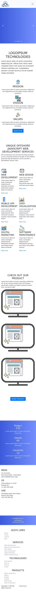

# PROJECT ipsumTechnologies- Just an Imaginary company

This is an imaginary company website build with semantic HTML5, CSS3 and basic JS.

## Table of contents

- [Overview](#overview)
  - [Screenshot](#screenshot)
  - [Links](#links)
- [My process](#my-process)
  - [Built with](#built-with)
  - [Time required](#time-required)
  - [Useful resources](#useful-resources)
- [Author](#author)

## Overview

### Screenshot

### Links

- Code File URL: [github.com](https://github.com/Jyotimoykathar/ipsumTechnologies)
- Live Site URL: [netlify.app](https://ipsumtechnologies.netlify.app/)

## My process

### Built with

- Semantic HTML5 markup
- CSS custom properties
- Flexbox Css
- Grid Css
- Basic JS

### Time required

Still development stage

### Continued development

I still have a lot to implement feature and designs of the page with CSS3 design and
Animation and JS to make the page more interactive and beautiful.

### Useful resources

- [MDN](https://developer.mozilla.org/en-US/) - This website helped me to any thing i had to look upon.
- [ION ICONS](https://ionic.io/ionicons) - This is an amazing website with open source icons that helps to add icons easily to your webpages.

## Author

- Github page- [Jyotimoykathar](https://github.com/Jyotimoykathar/)
